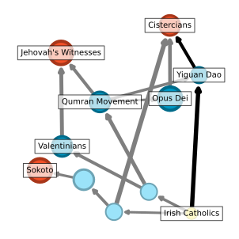

## Overview



Pre-review code for "Cognitive Attractors in the Cultural Evolution of Religion".

Victor Møller Poulsen and Simon DeDeo

Submitted to *COGSCI*, 1 February 2023.

Relies on preprocessing, and inference from https://github.com/victor-m-p/cultural-landscapes (https://www.mdpi.com/1099-4300/25/2/264)

## Components

### ```/data```
* ```data/mdl_experiments```: processed DRH data (post-MPF).
* ```data/clean```: processed DRH data (pre-MPF).
* ```data/reference```: reference files (i.e. ensuring links between questions and cultures). 
* ```data/analysis```: files used for the DRH analysis in ```/DRH```. 

Raw data from the DRH (i.e. pre-curation) is not provided given size limits.
The analysis presented here relies on the curation and inferred parameters of https://github.com/victor-m-p/cultural-landscapes.

### ```/fig```
Figures for "Inferring Cultural Landscapes with the Inverse Ising Model". Currently only the figures for ```5. Results: The Database of Religious History``` (see ```/DRH``` for code). 


### ```/tables```
Tables for "Inferring Cultural Landscapes with the Inverse Ising Model". In particular, tables documenting the DRH dataset used in the article. See ```/DRH``` for code. 

### ```/DRH```
```DRH``` contains the ```Python``` (and ```Julia```) code to reproduce the DRH analysis as presented in "Inferring Cultural Landscapes with the Inverse Ising Model". It contains both the preprocessing, data-curation, creation of tables (for ```/tables```) and creation of figures (for ```/fig```). See ```/DRH``` for more details. 

### ```/MPF_CMU``` 
the ```MPF_CMU``` optimized C code is not included in this workspace. We use the output from https://github.com/victor-m-p/cultural-landscapes (refer there for the inference algorithm).

<!-- LICENSE -->
## License
Distributed under the MIT License. See `LICENSE.txt` for more information.

## Contact
Simon DeDeo (for ```/MPF_CMU``` questions):
* Twitter: [@LaboratoryMinds](https://twitter.com/LaboratoryMinds)
* Github: [@simon-dedeo](https://github.com/simon-dedeo)
* Mail: sdedeo@andrew.cmu.edu

Victor Poulsen (for other questions): 
* Twitter: [@vic_moeller](https://twitter.com/vic_moeller) 
* GitHub: [@victor-m-p](https://github.com/victor-m-p)
* Mail: victormoeller@gmail.com


<!-- ACKNOWLEDGMENTS -->
## Acknowledgments
We are particularly grateful to the creaters of ```conIII``` and the maintainers and creators of the ```Database of Religious History (DRH)```.

* [ConIII](https://github.com/eltrompetero/coniii)
* [Database of Religious History (DRH)](https://religiondatabase.org/landing/)

## FUNDING
This work used the Extreme Science and Engineering Discovery Environment (XSEDE), which is supported by National Science Foundation grant number ACI-1548562. Specifically, it used the Bridges-2 system, which is supported by NSF award number ACI-1928147, at the Pittsburgh Supercomputing Center (PSC), under grant HUM220003. This work was supported in part by the Survival and Flourishing Fund.
