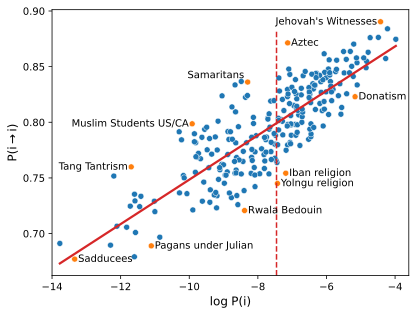

## Overview



Pre-review code for "Cognitive Attractors in the Cultural Evolution of Religion".

Victor Møller Poulsen and Simon DeDeo

Submitted to *COGSCI*, 1 February 2023.

Relies on preprocessing, and inference from https://github.com/victor-m-p/cultural-landscapes (https://www.mdpi.com/1099-4300/25/2/264)
For information on preprocessing and inference see above. 

## Components

### ```/data```
* ```data/preprocessing```: processed DRH data forked from https://github.com/victor-m-p/cultural-landscapes
* ```data/analysis```: new analysis (relying on ```data/preprocessing```)

### ```/fig```
Figures for "Cognitive Attractors in the Cultural Evolution of Religion". 

### ```/tables```
Tables for "Cognitive Attractors in the Cultural Evolution of Religion". 

### ```/analysis```
```Python``` (and ```Julia```) code to reproduce the analysis, figures (```/fig```) and tables (```/tables```) in "Cognitive Attractors in the Cultural Evolution of Religion". 

<!-- LICENSE -->
## License
Distributed under the MIT License. See `LICENSE.txt` for more information.

## Contact
Simon DeDeo (for ```/MPF_CMU``` questions):
* Twitter: [@LaboratoryMinds](https://twitter.com/LaboratoryMinds)
* Github: [@simon-dedeo](https://github.com/simon-dedeo)
* Mail: sdedeo@andrew.cmu.edu

Victor Poulsen (for other questions): 
* Twitter: [@vic_moeller](https://twitter.com/vic_moeller) 
* GitHub: [@victor-m-p](https://github.com/victor-m-p)
* Mail: victormoeller@gmail.com

<!-- ACKNOWLEDGMENTS -->
## Acknowledgments
We are particularly grateful to the creaters of ```conIII``` and the maintainers and creators of the ```Database of Religious History (DRH)```.

* [ConIII](https://github.com/eltrompetero/coniii)
* [Database of Religious History (DRH)](https://religiondatabase.org/landing/)

## FUNDING
This work used the Extreme Science and Engineering Discovery Environment (XSEDE), which is supported by National Science Foundation grant number ACI-1548562. Specifically, it used the Bridges-2 system, which is supported by NSF award number ACI-1928147, at the Pittsburgh Supercomputing Center (PSC), under grant HUM220003. This work was supported in part by the Survival and Flourishing Fund.